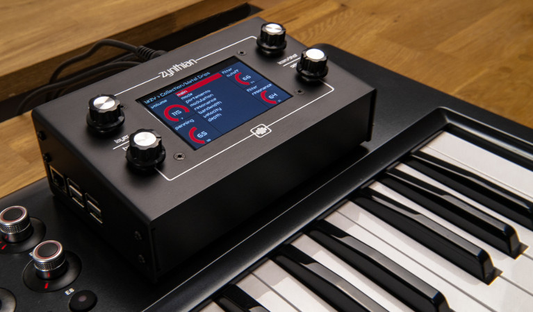
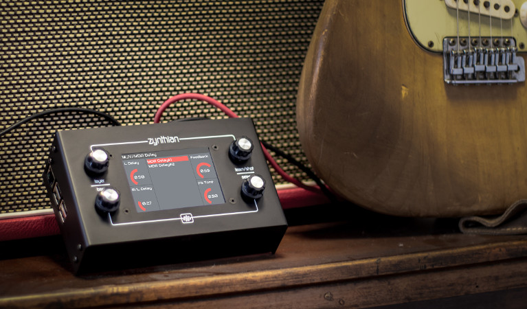
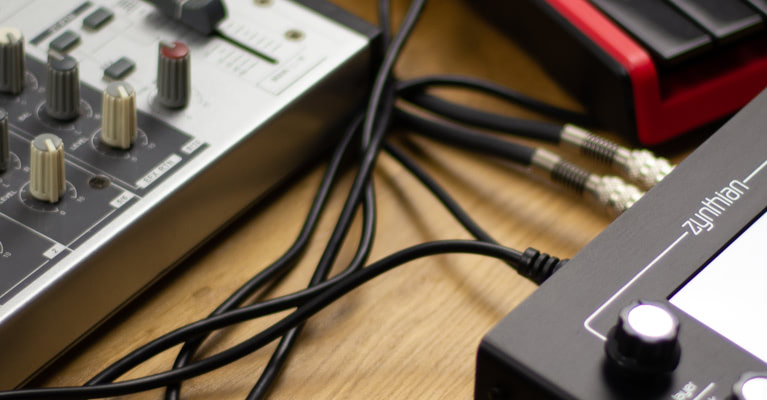

[div class="timeline"]
* [figure class="timeline__image"][/figure]
[span class="timeline__content"]
### [Keyboard Expander](/use-cases/keyboard-expander)
##### Let your fingers play the sound you want.
Acoustic & electric pianos, organs, vintage synthesizers, virtual analog synthesizers, soundfonts, ... 
 

 
MIDI learning is quick & easy, allowing you to manage everything from your MIDI keyboard/controller, including fast instrument changes and controlling the sound parameters you want.
[[Learn More]](/use-cases/keyboard-expander)[/span]

* [figure class="timeline__image"][/figure]
[span class="timeline__content"]
### [Effects Unit](/use-cases/effects-unit)
##### Would you like a custom FX-chain for every song? A full-featured looper?
Sooper Looper, reverbs, echoes, delays, choruses, flangers, phasers, distortions, EQs, compressors, wahs, grains, vocoders, autotune, ... 
 

 
Create FX-chains arranging processors in series/parallel. With MOD-UI you can create the more bizarre pedalboards you ever imagined. Infinite fun with the live looping sampler!
[[Learn More]](/use-cases/effects-unit)[/span]

* [figure class="timeline__image"][/figure]
[span class="timeline__content"]
### [Groovebox / micro-DAW](/use-cases/groovebox-udaw)
##### A powerful production tool in a small container
It's fully multi-timbral and it features multitrack recording, audio sampler and a powerful step-sequencer designed for live-performing and song composing. 
 

 
Plug & play control with a growing list of supported midi controllers. Explore sonic landscapes and go beyond the limits with Pure Data generative capabilities.
 
[[Learn More]](/use-cases/groovebox-udaw)[/span]
[/div]

