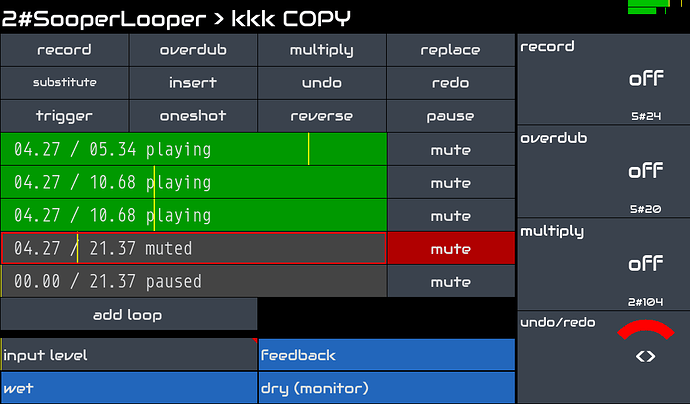

[column class="column-offset-1 column-6 main-cases"]
Zynthian can be used as a powerful Audio Effects unit allowing creation off a customized effect-chain for every available audio input.

Official Zynthian Kits have 2 balanced audio-inputs with independent gain-control ranging from -12db to 32dB. Read the full specifications [here](/technical-specifications). You can directly connect a wide rage of input devices, like dynamic microphones, electric & acoustic guitars, piezos, line-in, etc.

Zynthian supports the LV2-plugin standard and includes hundreds of audio-processing plugins. You can combine them as you like for sculpting the sound, recreating vintage landscapes or exploring new textures.

The native Zynthian-UI allows you to manage up to 16 FX-chains. With the MOD-UI web interface, you can create the more bizarre pedalboards.

If you like looping, Sooper Looper engine is fully integrated, allowing to control up to 6 independet loops with instant record, overdub, reverse, multiply, replace, time-stretch, pitch-shift, and much more.

[figure class=""][/figure]

The MIDI-learning workflow is quick & easy. You can adjust the parameters you want from your favorite MIDI controller. Buttons can be assigned to presets (program-change), and knobs/faders to parameters (CC).

Default latency and jitter is low enough for most players, but if you are looking for extra-low latency, audio configuration can be tweaked.
[/column]

[column class="column-offset-1 column-4 sidebar-cases"]
## Audio
<small>Clean Guitar, by Rodrigo Amaral</small>

<small>Crunch Guitar, by Rodrigo Amaral</small>

<small>Lead Guitar, by Rodrigo Amaral</small>

<small>Kalimba Mistery Forest Dream, by Jofemodo</small>

[div class="text-right link-extrademos"]
<a href="https://wiki.zynthian.org/index.php/Zynthian_Sound_Demos" target="_blank">[More Demos]</a>
[/div]
[/column]
