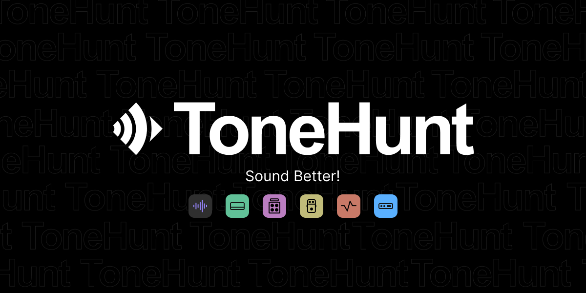

[column class="column-offset-1 column-6 first"]
AIDA-X is an Amp Model Player, allowing it to load models of AI trained music gear, which you can then play through!

Its main intended use is to provide high fidelity simulations of amplifiers. However, it is also possible to run entire signal chains consisting of any combination of ampplifier, cabinet, distortion, drive, fuzz, boost and eq.

#### Get models from a large community

[Tonehunt.org](https://tonehunt.org/models?tags%5B0%5D=aida-x) has become the place to get the best models for Neural Amp Modeler, Aida-X and Proteus, while expanding to support more platforms in the future. Not only models, but our collection of IRs is also growing and becoming very popular within the platform. 

[[figure class="center"][/figure]](https://tonehunt.org/models?tags%5B0%5D=aida-x)

#### Loading files
AIDA-X comes built-in with a single Amp Model and Cabinet IR. Click on the related filename to open a file browser and load a different file.
The little icon on the left side allows to turn on/off the Amp Model and Cabinet IR. Both wav and flac audio formats are supported for IR files.

From the zynthian-ui you can also load model and IR files easily. Simply move the knob assigned to the model or IR controls and the file selector will popup.

[/column]

[column class="column-offset-1 column-4"]
## Audio
<small>Always with me, always with you (Joe Satriani, by Stojos)</small>

<small>Distortion test, by stojos</small>

<small>Clean test, by stojos</small>

 

## Links:
+ [AIDA-X Website](https://aida-x.cc/)
+ [AIDA-X Models in ToneHunt](https://tonehunt.org/models?tags%5B0%5D=aida-x)
+ [Source Code](https://github.com/AidaDSP/AIDA-X)
[/column]

