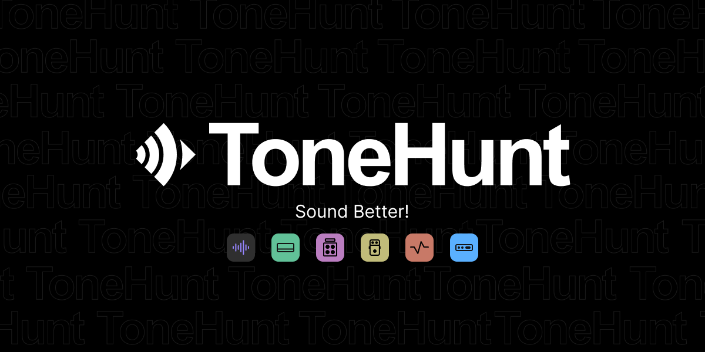

[column class="column-offset-1 column-6 first"]
Ratatouille is a Neural Model loader and mixer for Linux/Windows.
It can load two models, which can be *.nam files (Neural Amp Modeler) or *.json / .aidax files (RTNeural) and use
the "Blend" control to blend between the two models and mix them to simulate the specific tone you are looking for.
Of course, you can also load just a single model file and "Blend" control will do nothing.

Ratatouille uses parallel processing for the neural models, so, loading a second neural model wouldn't be
remarkable on the dsp load.  Optionally, Ratatouille could run the complete process in buffered mode.
This reduces the dsp load even more. The resulting latency will be reported to the host so that it could be
compensated. For information the resulting latency will be shown on the GUI.

The "Delay" control could add a small delay to overcome phasing issues, or to add some color/reverb to the sound.
The 'ctrl' key activate fine tuning to dial in a sample accurate delay. Ratatouille can also detect the phase
offset and compensate it internally.

To round up your sound you can load two Impulse Response Files and mix them to your needs. IR-files could be
normalised on load, so that they didn't influence the loudness.

Ratatouille.lv2 supports resampling when needed to match the expected sample rate of the loaded models. Both
models and the IR Files may have different expectations regarding the sample rate.
#### Get models from a large community

[Tonehunt.org](https://tonehunt.org) has become the place to get the best models for Neural Amp Modeler, Aida-X and Proteus, while expanding to support more platforms in the future. Not only models, but our collection of IRs is also growing and becoming very popular within the platform.

[[figure class="center"][/figure]](https://tonehunt.org)

#### Loading files

From the zynthian-ui you can load model files easily. Simply move the knob assigned to the model control and the file selector will popup.

[/column]

[column class="column-offset-1 column-4"]
 

## Links:
+ [Source Code](https://github.com/brummer10/Ratatouille.lv2)
+ [Ratatouille's Models in ToneHunt](https://tonehunt.org)
[/column]

